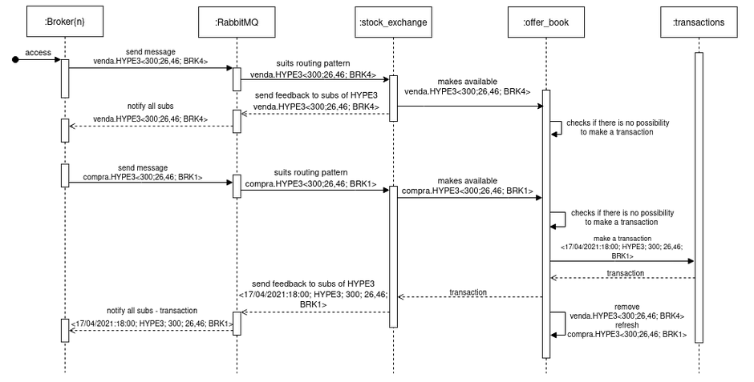
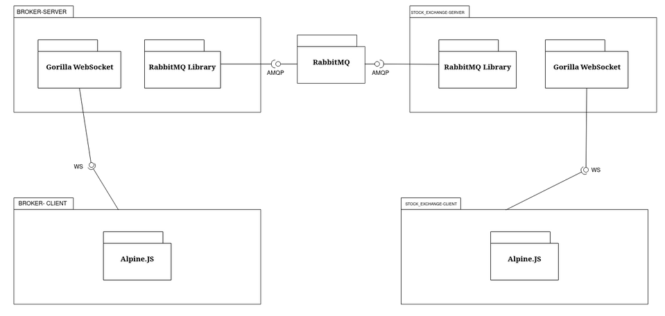
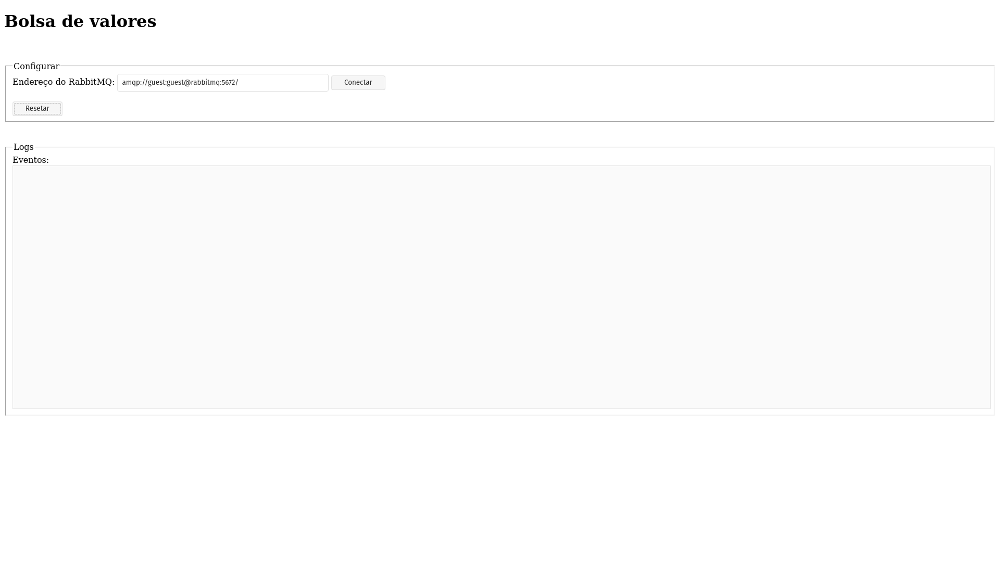
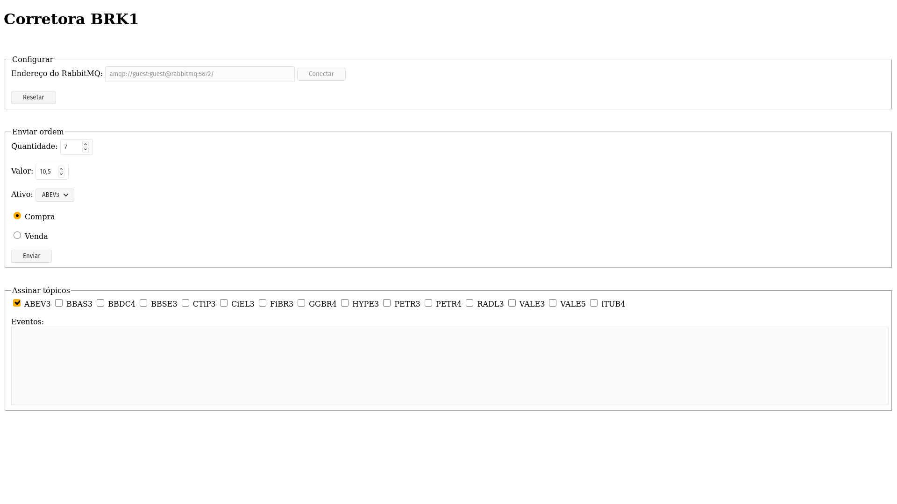

# Corretora de Valores com Rabbit MQ

**Gabriel Moreira Chaves, gabriel.chaves.1200613@sga.pucminas.br**

**Ian Bittencourt Andrade Jacinto, ian.andrade@sga.pucminas.br**

---

_Curso de Engenharia de Software, Unidade Praça da Liberdade_

_Instituto de Informática e Ciências Exatas – Pontifícia Universidade de Minas Gerais (PUC MINAS), Belo Horizonte – MG – Brasil_

---

_**Resumo**. Neste presente trabalho foi desenvolvido um sistema para uma bolsa de valores qualquer, utilizando o RabbitMQ. Com o objetivo de demonstrar a ocorrência do funcionamento de um sistema que envolve transações em uma bolsa de valores qualquer, tem-se o resultado de um software. Este, é resposável por simular as transações de compra e venda em uma bolsa de valores._

---

**1. Introdução**

1.1. Contextualização

Apple, Microsoft, Netflix e Google estão entre as maiores empresas de tecnologia, mas com relevância e ascenência mundiais (GUSMÃO, 2020). Não só essas empresas gigantes, mas a maioria das empresas que estão na bolsa, utilizam os recursos captados na bolsa para investir em novos projetos, estruturas e em seus serviços.

No contexto atual, a bolsa de valores está cada vez mais acessível e é o investimento ideal para atual contexto econômico (TERRA, 2020). Comprar uma pequena parte de uma empresa conhecida, tornar-se sócio e receber dividendos e participação nos ganhos, para muitos, é algo inacreditável. No entanto, trata-se de algo muito mais palpável do que uma fração da população imagina, basta investir em ações.

1.2. Problema

Nessa perspectiva, como as operações em bolsa de valores estão se popularizando e se tornando cada dia mais importantes em nossa sociedade, o presente trabalho buscou resolver os seguintes questionamentos:

- Qual a arquitetura adotada para representar um sistema de transaçãoes na bolsa de valores?

- Como ocorre a comunicação entre diversos eventos em uma bolsa de valores?

1.3. Objetivo geral

O objetivo geral é demonstrar como ocorre o funcionamento de um sistema que envolve transações em uma bolsa de valores qualquer.

1.3.1. Ojbetivos específicos

Como objetivos específicos, apresentamos:

- Compreender o que é uma bolsa de valores;

- Analisar a arquitetura da maiora das bolsas de valores;

1.4. Justificativas

A importância deste trabalho se justifica pela necessidade de compreender o funcionamento das bolsas de valores em geral, além de aplicar os conhecimentos teóricos construídos na disciplina de Laboratório de Desenvolvimento de Aplicações Móveis e Distribuídas, de forma prática.

**2. Projeto da Solução**

2.1. Requisitos funcionais

| No. |                                                                                 Descrição                                                                                 | Prioridade |
| --- | :-----------------------------------------------------------------------------------------------------------------------------------------------------------------------: | ---------: |
| 1   | Envia à bolsa de valores uma ordem de compra com o tópico compra.ativo indicando que a corretora deseja comprar quant lotes de ações de um ativo pelo preço de val reais. |       Alta |
| 2   |  Envia à bolsa de valores uma ordem de venda com o tópico venda.ativo indicando que a corretora deseja vender quant lotes de ações de um ativo pelo preço de val reais.   |       Alta |
| 3   |                         Envia ao tópico transacao.ativo uma mensagem notificando que a bolsa de valores realizou uma transação de compra e venda.                         |       Alta |
| 4   |                                             Possibilidade de se inscrever para receber uma transação de um determinado ativo                                              |       Alta |

2.2. Tecnologias

A linguagem escolhida para o servidor foi [Golang](https://golang.org/). As tecnologias escolhidas para compor a construção do servidor foram [Gorilla WebSocket](https://github.com/gorilla/websocket), uma biblioteca que implementa o sistema de comunicação [Websocket](www.rfc-editor.org/rfc/rfc6455.txt) em Go e [RabbitMQ Library](https://github.com/streadway/amqp), para a utilização do sistema de mensageiria, [RabbitMQ](https://www.rabbitmq.com/), baseado no servidor de hosteamento [AMQP](https://www.rabbitmq.com/tutorials/amqp-concepts.html) `0.9.1`. A IDE escolhida foi a [GoLand](https://www.jetbrains.com/pt-br/go/).

No lado do cliente, o [Alpine.js](https://github.com/alpinejs/alpine) foi utilizado, para garantir o three way data binding, que é a sincronização dos dados gráficos do cliente com os dados elementares do servidor.

Para fazer o ambiente de produção, o [Docker](https://www.docker.com/) juntamente com o docker-compose foram utilizados, representando cada parte do sistema como um microsserviço.

**3. Modelagem de dados**

3.1. Diagrama de Sequência

3.2. Diagrama de Componentes

**4. Sistema desenvolvido**

4.1. Sistema

O sistema desenvolvido é exposto a partir de três conjuntos de portas, sendo estas:

- Bolsa de valores, na porta `3000`

- Corretoras, nas portas `3001 a 3005`

- RabbitMQ, na porta `15672`

A seguir, serão exibidas as telas do sistema, bem como uma descrição de como utilizá-las.

4.2. Telas

Tela responsável pela conexão da bolsa de valores (servidor), com o sistema de mensageiria (RabbitMQ). Através de uma URL, o usuário se conecta com o endereço do RabbitMQ, que será responsável por exibir todas as mensagens trocadas pelo sistema de bolsa de valores na seção "logs", abaixo da seção "configurar". Caso o usuário queira finalizar a conexão, basta clicar no botão de "resetar".

Tela responsável por operar os ativos no sistema de bolsa de valores. A partir desta tela, é possível se conectar ao sistema de mensageiria RabbitMQ, que irá fazer o roteamento das mensagens, informando o que está sendo realizado: uma compra, uma venda ou uma transação. Para enviar uma ação, o usuário deve estar conectado ao sistema e preencher o campo "enviar ordem", com a quantidade de ativos que deseja comprar ou vender, o valor que deseja empregar para cada operação, o tipo de ativo, seguindo uma lista de ativos pré estabelecidos e a ação. Logo em seguida, para conseugir ouvir os eventos que estão ocorrendo no sistema, para cada ativo, o usuário necessita de assinar algum tópico, na seção "assinar tópicos", para isto, é necessário marcar qual ativo será assinado. Na aba "eventos", todos os eventos referentes aos ativos assinados serão exibidos.

4.3. Utilização 

1. Para acessar o sistema, é necessário estar na pasta raiz do sistema, e deferir o comando `docker-compose up`;
2. Em seguida, acesse `localhost:3000` e conecte-se ao RabbitMQ;
3. Para acessar a primeira corretora, é necessário acessar `localhost:3001` e conectar-se ao RabbitMQ;
4. Logo, já é possivel utilizar o sistema. 

**5. Avaliação**

O trabalho atendeu todas as expectativas colocadas, pois cumpre com o objetivo geral de forma clara e sem desvios. Além disso, foi possível explorar o funcionamento do conceito de three way data binding, que é bastante interessante para serviços que necessitam estarem sincronizados entre comunicações de dados.

**6. Conclusão**

Com a execução do trabalho, foi possível perceber a importância das bolsas de valores no mundo, não só no aspecto econômico, mas também a sua relação com a tecnologia. Dessa forma, foi possível entender como ocorre o funcionamento de uma bolsa de valores no seu aspecto estrutural e conseguir estrurar uma arquitetura, utilizando um middleware de mensageiria, que possa reproduzir o funcionamento de um sistema de transações de ativos na bolsa de valores.

**REFERÊNCIAS**

**[1.1]** - _GUSMÃO, Tito. **Empresas de tecnologia na Bolsa: descubra quais são e como investir**. Warren Blog, 23 out. 2020. Disponível em: <https://warren.com.br/blog/empresas-de-tecnologia-na-bolsa/>. Acesso em: 17 abr. 2021._

**[1.2]** - _TERRA. In: **Bolsa de Valores está mais acessível e é investimento ideal para atual contexto econômico**. [S. l.], 3 jan. 2020. Disponível em: <https://www.terra.com.br/noticias/dino/bolsa-de-valores-esta-mais-acessivel-e-e-investimento-ideal-para-atual-contexto-economico,b01f4974a44e341d8b38fbd4ca7bd9b6uyz9wfyw.html>. Acesso em: 17 abr. 2021._
